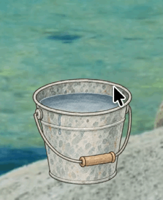

# CursorWasher

[English](README.en.md) · [Русский](README.md)

## Why

Touched something unpleasant with your cursor and now want to give it a good scrub with soap? One click, and your cursor is as good as new. With a clean cursor, you can touch your own files and pet your designs again.

[Grab the macOS installer](https://github.com/Oladii/CursorWasher/releases/latest/download/CursorWasher-Installer.dmg) · [Download for Windows](https://github.com/Oladii/CursorWasher/releases/latest/download/CursorWasher.zip)



## How to launch on macOS


I'm just a country boy, so the bucket doesn't have a Developer ID signature yet, which means macOS will block the downloaded app. [Apple's instructions for allowing it to open](https://support.apple.com/en-ie/102445).

## How to launch on Windows

The Windows app is not yet digitally signed, so SmartScreen may display “Windows protected your PC”.

If you downloaded the app from the [official CursorWasher release](https://github.com/Oladii/CursorWasher/releases/latest), click **“More info” → “Run anyway”**.

## What it can do

- Wash your cursor.
- Lift your spirits.
- Keep the bucket on top of all windows or leave it on the desktop.

## What it cannot do

- Buy beer.
- Do anything useful.

## Installation

### macOS

Download the [macOS installer](https://github.com/Oladii/CursorWasher/releases/latest/download/CursorWasher-Installer.dmg). Requires macOS 13 or later. Running on Intel has not been tested.

1. Open the DMG.
2. Drag `CursorWasher` to the `Applications` folder in the window that opens.
3. Launch the app from Applications.
4. Set it to launch at login if you need the bucket often.

### Windows

Download [CursorWasher.zip](https://github.com/Oladii/CursorWasher/releases/latest/download/CursorWasher.zip). Requires .NET Framework 4.8.

1. Extract the archive into a separate folder.
2. Run `CursorWasher.exe`. No installer or administrator privileges are needed.

## Building from source

If you'd like to build the bucket yourself (why?), download the source code.

### macOS

[Download macOS sources](https://github.com/Oladii/CursorWasher/releases/latest/download/CursorWasher-macOS-Sources.zip).

You'll need Apple's developer tools with Swift and the macOS SDK.
In the repository, open the `macOS` folder. In the separate source archive, open the folder containing `scripts`.

```sh
bash scripts/package.sh
```

This builds the app and an installer DMG in `Build/`.

To build only the app:

```sh
bash scripts/build.sh
```

### Windows

[Download Windows sources](https://github.com/Oladii/CursorWasher/releases/latest/download/CursorWasher-Windows-Sources.zip).

You'll need .NET Framework 4.8; no external packages are required. Open the `Windows` folder in the repository or extracted source archive and run in PowerShell:

```powershell
.\scripts\build.ps1 -Test -Package
```

The app will be in `App`, and the ZIP in `.build/Packages/CursorWasher.zip`.

Windows builds and tests also run in [GitHub Actions](https://github.com/Oladii/CursorWasher/actions/workflows/windows.yml).
The ZIP is available in each successful run's artifacts; these builds are currently unsigned.

## Uninstalling

### macOS

Choose **Quit** from the app menu, then delete `CursorWasher` from Applications.
If you added it to Login Items, remove that entry too.
To also remove the saved window layer, run this in Terminal after quitting:

```sh
defaults delete local.cursorwash.probe
```

### Windows

Choose **Quit** from the tray menu, then delete the app folder and any shortcut you created for it.
Local settings and logs (`CursorWasher.settings`, `CursorWasher.log`) are stored in the same folder.

## License and privacy

[MIT License](LICENSE) — Copyright (c) 2026 Oladii.
[Privacy information](PRIVACY.md): the app works locally and does not send data over the network.

## Code signing policy

[Code signing policy](CODE_SIGNING.md). The app is currently unsigned; SignPath enrollment is not yet complete.
